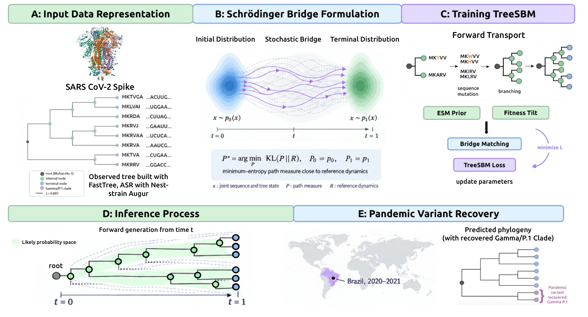

# TreeSBM: Tree-Valued Schrödinger Bridge Matching

<p align="center">
  
</p>

<p align="center"><em><strong>Figure.</strong> Overview of TreeSBM. <strong>(A)</strong> Observed Spike trees (FastTree + Augur ASR) with per-node sequences. <strong>(B)</strong> Schrödinger bridge between root and full phylogeny joint sequence–tree states. <strong>(C)</strong> Bridge matching with an ESM prior and optional fitness tilt. <strong>(D)</strong> Forward generation from a root. <strong>(E)</strong> Pandemic variant recovery (e.g., Gamma/P.1).</em></p>

A generative model for phylogenetic trees. Given a root ancestral sequence, TreeSBM grows a bifurcating phylogeny whose leaves are descendant sequences with biologically plausible mutations and branching topology.

## Method

TreeSBM uses **Schrödinger Bridge Matching** to learn a process from a root-only tree (\(T=0\)) to a full observed phylogeny (\(T=1\)). At intermediate time \(t\), a partial tree \(T_t\) is sampled by time-cutting the observed tree, and the model is supervised on the rates that drive \(T_t\) toward \(T_1\).

The learned rate decomposes as:

```
log R_θ = log R0 + c_θ
```

where \(R_0\) is ESM-2’s masked language model head (amino-acid substitution prior) and \(c_θ\) is a learned correction conditioned on tree context and bridge time \(t\).

**Architecture**
- **NodeEncoder** — ESM-2 embedding + structural features + Laplacian PE → 128-d
- **TreeEncoder** — graph transformer with temporal causal attention, conditioned on \(t\)
- **RateHeads** — per active leaf: mutation logits \([L×20]\), branching rate \(λ\), branch length, stop probability

**Losses:** sequence CE, topology Poisson NLL, branch-length MSE, stop BCE, optional ESM PLL regularizer.

## Setup

```bash
conda env create -f environment.yml
conda activate treesbm
```

Requires MAFFT, FastTree, and augur (Nextstrain conda channel).

## Usage

**Precompute** (once per dataset):

```bash
python scripts/precompute_plm.py --data data/train
python scripts/precompute_ref_rates.py --data data/train
```

**Train:**

```bash
python scripts/train.py --data data/train --epochs 300 --patience 50
```

**Generate** from a root sequence:

```bash
python scripts/generate_tree.py \
    --checkpoint checkpoints/best.pt \
    --root-seq <amino_acid_sequence> \
    --n-steps 50 \
    --branch-rate-scale 6.0 \
    --max-seq-len 566 \
    --output generated_tree.nwk
```

**Evaluate** on held-out test trees:

```bash
python scripts/eval_test_set.py \
    --checkpoint checkpoints/best.pt \
    --data data/train \
    --split checkpoints/split_indices.json \
    --n-steps 50 \
    --max-leaves 200 \
    --branch-rate-scale 6.0
```

## Data splits

Prior (geo / temporal) and epidemic holdout protocols:

- [`benchmarks/SPLITS.md`](benchmarks/SPLITS.md)
- [`benchmarks/EPIDEMIC_TREE_SPLITS.md`](benchmarks/EPIDEMIC_TREE_SPLITS.md)

## Repository layout

```
src/                 # bridge, TreeEncoder, RateHeads, TreeDataset
scripts/train.py     # training (Algorithm 1)
scripts/generate_tree.py
scripts/eval_test_set.py
scripts/precompute_plm.py
scripts/precompute_ref_rates.py
benchmarks/          # table metrics + baseline adapters
assets/              # figures
data/                # formed trees + split metadata
```
